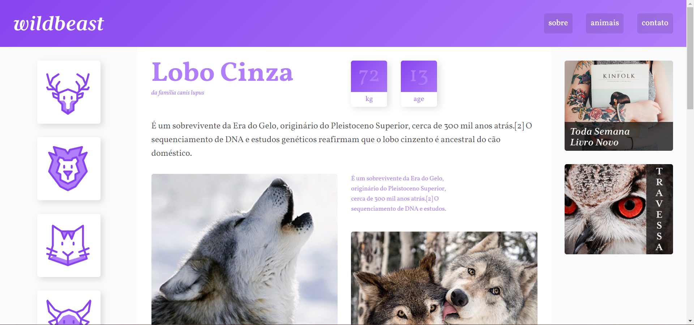

# Wildbeast

[GitHub repo size](https://img.shields.io/github/repo-size/Nikolas-as/Wildbeast?style=for-the-badge)

> Esse é um projeto que eu fiz para treinar o meu css grid layout
> 
## Linguagens utilizadas

- [CSS3](https://developer.mozilla.org/pt-BR/docs/Web/CSS)
- [HTML](https://developer.mozilla.org/pt-BR/docs/Web/HTML)

## 🤝 Colaboradores

Agradecemos às seguintes pessoas que contribuíram para este projeto:

<table>
  <tr>
    <td align="center">
      <a>
         
        
          <b>Nikolas-as</b>
        
      </a>
    </td>
</table>
